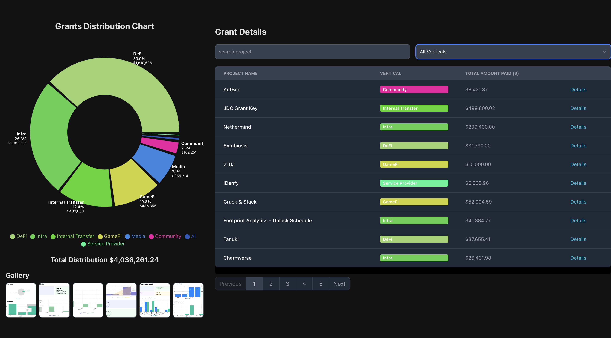

# Taiko Grant Dashboard

A modern, interactive dashboard for tracking and visualizing Taiko grant distributions. This application provides a comprehensive view of grant allocations across different verticals, with detailed transaction information and visual analytics.



## Features

- **Interactive Data Table**: View and filter grant transactions with detailed information
- **Vertical Filtering**: Filter grants by vertical (DeFi, GameFi, Infra, etc.)
- **Pie Chart Visualization**: Visual representation of grant distribution across verticals
- **Transaction Details**: View detailed information about each grant transaction
- **Responsive Design**: Works seamlessly on desktop and mobile devices

## Tech Stack

- **Framework**: [Next.js](https://nextjs.org/) (React)
- **Styling**: [Tailwind CSS](https://tailwindcss.com/)
- **State Management**: [Zustand](https://zustand-demo.pmnd.rs/)
- **Data Fetching**: [tRPC](https://trpc.io/)
- **Database**: [Prisma](https://www.prisma.io/) with [Vercel Postgres](https://vercel.com/storage/postgres)
- **Charts**: [Recharts](https://recharts.org/)
- **CSV Parsing**: [csvtojson](https://www.npmjs.com/package/csvtojson)

## Getting Started

### Prerequisites

- Node.js 18+ or Bun
- npm, yarn, or pnpm

### Installation

1. Clone the repository:
   ```bash
   git clone https://github.com/swarna1101/grant-dashboard.git
   cd grant-dashboard
   ```

2. Install dependencies:
   ```bash
   npm install
   # or
   yarn install
   # or
   pnpm install
   ```

3. Set up environment variables:
   - Copy `.env.example` to `.env`
   - Update the variables with your values:
     ```
     NEXT_PUBLIC_DATA_URL=your_gist_url_here
     ```

4. Run the development server:
   ```bash
   npm run dev
   # or
   yarn dev
   # or
   pnpm dev
   ```

5. Open [http://localhost:3000](http://localhost:3000) in your browser to see the application.

## Project Structure

- `src/app`: Next.js app router pages
- `src/components`: Reusable UI components
  - `datatable.tsx`: Main data table component
  - `taikopiechart.tsx`: Pie chart visualization
  - `project-details.modal.tsx`: Modal for detailed project information
- `src/hooks`: Custom React hooks
  - `useData.ts`: Hook for fetching and processing grant data
- `src/store`: Zustand store for state management
- `src/server`: Backend API routes and database access
- `src/utils.ts`: Utility functions

## Data Source

The dashboard pulls data from a CSV file hosted on GitHub Gist. The CSV contains the following columns:

- Date
- Tx Remarks
- Receiver
- Sender
- Amount In (USDT/USDC)
- Amount In (TAIKO)
- Amount Out (USDT/USDC)
- Amount Out (TAIKO)
- Supporting Documents
- Vertical
- Tx Hash
- Special Remarks

## Deployment

This project is configured for deployment on Vercel:

1. Push your code to GitHub
2. Import the repository in Vercel
3. Set the environment variables in the Vercel dashboard
4. Deploy

## Contributing

Contributions are welcome! Please feel free to submit a Pull Request.

## License

This project is licensed under the MIT License - see the [LICENSE](LICENSE) file for details.

## Acknowledgments

- [Taiko](https://taiko.xyz/) for the grant program
- [T3 Stack](https://create.t3.gg/) for the project scaffolding


